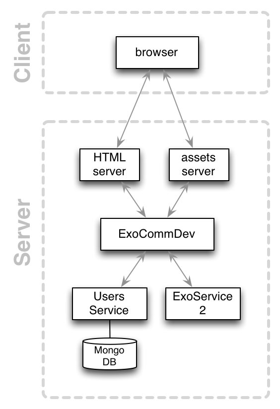

<<<<<<< HEAD
# SpaceTweet Example Application

SpaceTweet is a medium-sized example Exosphere application.
It is a Twitter clone that allows to
* log in as a user
* tweet things
* comment on tweets


## Architecture

This app consists of the following services:

* [web server](web-server): serves the web UI to the outside world
* [users service](https://github.com/Originate/exosphere-users-service): stores user information (name, email, ...)

Future work:
* [sessions service](sessions_service): stores who is logged in
* [tweets service](tweets_service): stores tweet data (content)
* [comments service](comments_service): stores comments for tweets




## Installation

This assumes you have the
[ExoSphere SDK](https://github.com/Originate/exosphere-cli-run)
installed.

* install and start MongoDB

* clone the [users service](https://github.com/Originate/exosphere-users-service)

* clone the [tweets service](https://github.com/Originate/exosphere-tweets-service)

* clone this repo

  ```
  git clone git@github.com:Originate/exosphere--example-app--space-tweet.git
  ```

* set up all the services in this application:

  ```
  exo setup
  ```

* start this application

  ```
  exo run
  ```
=======
# Tweets Service

[](https://circleci.com/gh/Originate/exosphere-tweets-service)
[](https://david-dm.org/originate/exosphere-tweets-service)
[](https://david-dm.org/originate/exosphere-tweets-service#info=devDependencies)
[](https://github.com/rstacruz/pnpm)

An Exosphere service for storing entry data


## Installation

* install MongoDB

  ```
  brew install mongodb
  ```

* install dependencies

  ```
  npm install
  ```


## running

* start MongoDB

  ```
  mongod --config /usr/local/etc/mongod.conf
  ```

* start the service

  ```
  env EXOCOMM_PORT=4000 EXORELAY_PORT=4001 bin/start
  ```


## Development

See your [developer documentation](CONTRIBUTING.md)
>>>>>>> tweets/master
